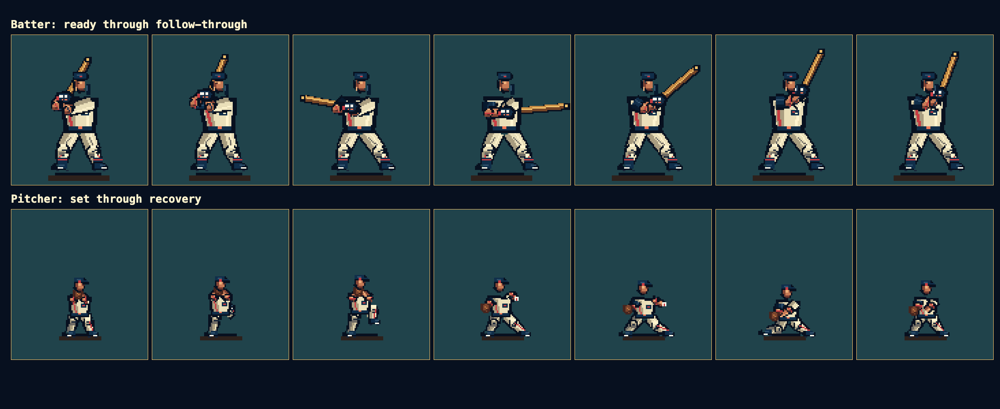

<!-- PROTOTYPE - NOT FOR PRODUCTION -->

# Character art comparison

## Outcome

The original batter, pitcher, and catcher have been rebuilt as native-grid
pixel characters. The second art pass specifically replaces constant-width
line limbs with tapered upper and lower segments, joint silhouettes, cloth and
muscle shadow planes, skin forearms, cuffs, trouser creases, kneecaps, calves,
socks, and cleats. The shipped art is rasterized from original geometry in
`src/player-art.mjs`; no pixels, palettes, poses, logos, uniforms, names, or
likenesses were extracted from a commercial game.

The left side is a reference-only gameplay capture from *Ken Griffey Jr.
Presents Major League Baseball* (1994). It is included only for visual critique
and is not loaded by the prototype. Source:
[Retro Gaming Stores screenshot](https://www.retrogamingstores.com/image/cache/data/snes/ken_griffey_jr_mlb_screenshot_1-800x800.png).
[MobyGames' screenshot index](https://www.mobygames.com/game/26316/ken-griffey-jr-presents-major-league-baseball/screenshots/)
independently identifies the title and its native SNES screenshots.

## Animation evidence

The first pass's self-assigned `9.1/10` score is withdrawn. Human review
correctly identified that the torso and equipment had more detail than the
constant-width arms and legs. This revision uses visual evidence and concrete
checks rather than assigning itself a replacement score.

| Acceptance check | Evidence |
|---|---|
| Joint anatomy | Separate shoulder, elbow, wrist, hip, knee, calf, and ankle silhouettes; joint clusters remain visible through all fourteen moving poses. |
| Limb volume | Upper and lower limbs taper independently and carry highlight, base, shadow, and crease clusters rather than uniform-width strokes. |
| Frame-specific motion | Weight transfer, leg lift, stride, release, bat extension, and follow-through alter the complete silhouette. |
| Uniform and equipment | Original crest, piping, belt, buckle, cuffs, socks, cleats, batting gloves, helmet flap, bat grain, glove web, mask, chest protector, and guards. |
| Pixel integrity | Automated raster tests require positive integer rectangles for every batter, pitcher, and catcher render; no canvas antialiasing is used. |
| Originality | Original code and fictional characters; no traced or extracted commercial sprite pixels. |

The reference uses licensed team presentation and dense blue pinstripes;
Diamond Dynasty uses a fictional navy, cream, and coral identity with broader
shadow clusters. The intended comparison is anatomical detail density and
animation readability, not a trace or one-to-one replica.

## Animation inventory

- Batter: ready, load, stride, contact, extension, high follow-through, settle
- Pitcher: set, hands rise, leg lift, stride/cock, release, follow-through, recover
- Catcher: original crouch with articulated legs, mitt, throwing arm, helmet,
  mask bars, chest protector, knee guards, and cleats

## Concept-art pass

The built-in image generation tool produced
`art/concepts/original-character-motion-concept.png` as an anatomy and motion
reference. The generated bitmap is not drawn directly in the game.

Final prompt, condensed only for line wrapping:

> Original fictional right-handed batter and pitcher concept sheet for a
> native 256x224 1994-era 16-bit baseball game; seven readable motion poses;
> athletic anatomy, uniform folds, face, gloves, cleats, seams, belt, socks,
> wood bat, leather glove, weight transfer and foreshortening; navy, cream and
> coral fictional Harbor City identity; hard pixel edges and limited palette;
> no real-player likeness, licensed logo, commercial sprite, text, watermark,
> antialiasing, blur, 3D rendering, or geometric block people.
