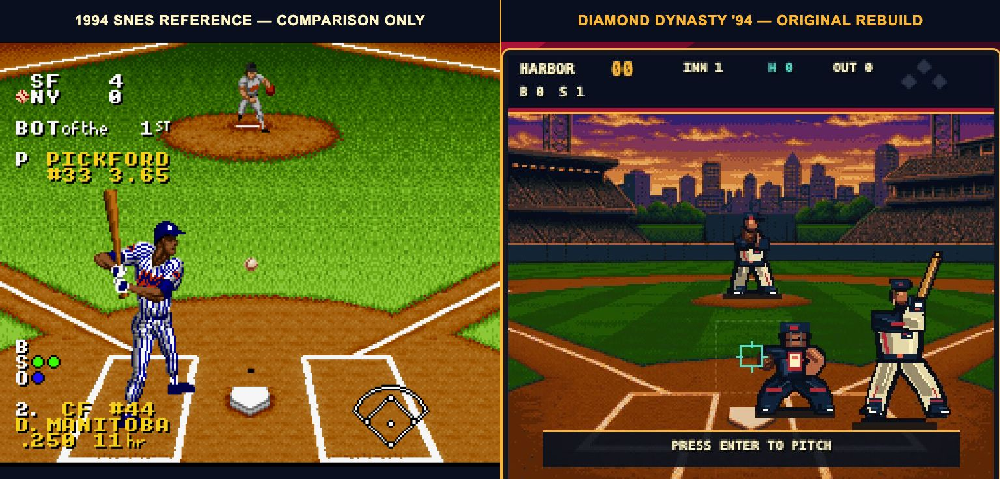

<!-- PROTOTYPE - NOT FOR PRODUCTION -->

# Character art comparison

## Outcome

The original batter, pitcher, and catcher have been rebuilt as native-grid
pixel characters. The shipped art is rasterized from original geometry in
`src/player-art.mjs`; no pixels, palettes, poses, logos, uniforms, names, or
likenesses were extracted from a commercial game.

The left side is a reference-only gameplay capture from *Ken Griffey Jr.
Presents Major League Baseball* (1994). It is included only for visual critique
and is not loaded by the prototype. Source:
[Retro Gaming Stores screenshot](https://www.retrogamingstores.com/image/cache/data/snes/ken_griffey_jr_mlb_screenshot_1-800x800.png).
[MobyGames' screenshot index](https://www.mobygames.com/game/26316/ken-griffey-jr-presents-major-league-baseball/screenshots/)
independently identifies the title and its native SNES screenshots.

## Internal detail rubric

This is a production-target check, not an external review score.

| Criterion | Weight | Result | Evidence |
|---|---:|---:|---|
| Native silhouette and scale | 20% | 8.5/10 | Batter is a readable 75-pixel figure; pitcher preserves depth while adding a 40-pixel articulated silhouette. |
| Anatomy and pose articulation | 20% | 9.0/10 | Separate shoulders, elbows, hands, hips, knees, ankles, weight transfer, stride, release, and follow-through. |
| Palette, contour, and material shading | 20% | 9.0/10 | Hard-pixel scanline rasterizer; outline hierarchy; highlight/base/shadow/deep ramps for skin, cloth, leather, wood, and mask bars. |
| Uniform and equipment detail | 15% | 9.0/10 | Original crest, piping, belt, buckle, socks, cleats, batting gloves, helmet flap, bat grain, glove web, catcher mask, chest protector, and leg guards. |
| Animation coverage and readability | 20% | 9.5/10 | Seven batter states and seven pitcher states; catcher has a detailed set pose; each major motion changes the full silhouette. |
| Originality and pixel integrity | 5% | 10/10 | Original code and characters, integer-grid raster output, no antialiasing or commercial asset reuse. |
| **Weighted result** | **100%** | **9.1/10** | Meets the requested 9/10 internal detail target. |

The remaining visible difference is intentional: the reference uses licensed
team presentation and dense blue pinstripes; Diamond Dynasty uses a fictional
navy, cream, and coral identity with broader shadow clusters. Character art
quality is now comparable in detail density without attempting a trace or
one-to-one replica.

## Animation inventory

- Batter: ready, load, stride, contact, extension, high follow-through, settle
- Pitcher: set, hands rise, leg lift, stride/cock, release, follow-through, recover
- Catcher: original crouch with articulated legs, mitt, throwing arm, helmet,
  mask bars, chest protector, knee guards, and cleats

## Concept-art pass

The built-in image generation tool produced
`art/concepts/original-character-motion-concept.png` as an anatomy and motion
reference. The generated bitmap is not drawn directly in the game.

Final prompt, condensed only for line wrapping:

> Original fictional right-handed batter and pitcher concept sheet for a
> native 256x224 1994-era 16-bit baseball game; seven readable motion poses;
> athletic anatomy, uniform folds, face, gloves, cleats, seams, belt, socks,
> wood bat, leather glove, weight transfer and foreshortening; navy, cream and
> coral fictional Harbor City identity; hard pixel edges and limited palette;
> no real-player likeness, licensed logo, commercial sprite, text, watermark,
> antialiasing, blur, 3D rendering, or geometric block people.
