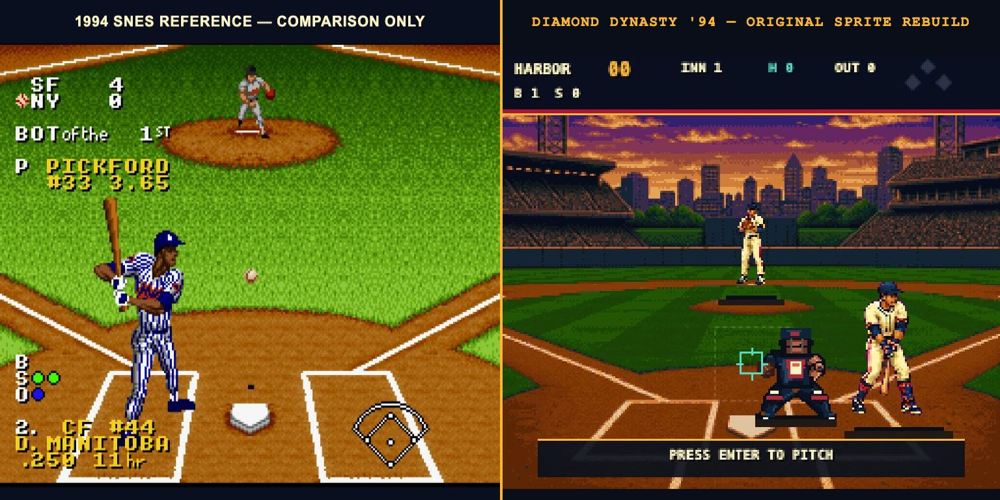
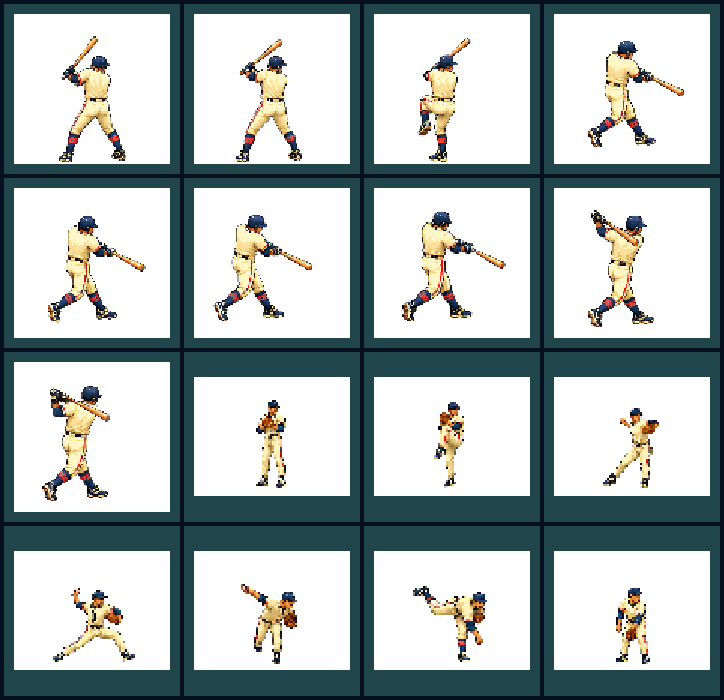
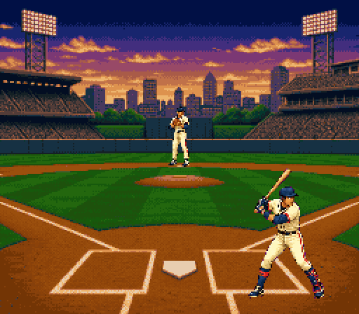

<!-- PROTOTYPE - NOT FOR PRODUCTION -->

# Character art comparison

## Outcome

The rejected procedural batter and pitcher have been replaced by sixteen
original alpha sprites: nine rear-view batting frames and seven pitching frames.
Each frame is a curated native-scale reduction of the original concept sheets
in `art/concepts/`, built reproducibly by
`tools/build-player-sprites.sh`. The figures now use coherent full-body
silhouettes, shaped shoulders and joints, readable hands, thigh/knee/calf
volume, uniform folds, equipment, and frame-specific foreshortening. No sprite,
palette, logo, uniform, name, or player likeness was extracted from a
commercial game.

The left side is a reference-only gameplay capture from *Ken Griffey Jr.
Presents Major League Baseball* (1994). It is included only for visual critique
and is not loaded by the prototype. Source:
[Retro Gaming Stores screenshot](https://www.retrogamingstores.com/image/cache/data/snes/ken_griffey_jr_mlb_screenshot_1-800x800.png).
[MobyGames' screenshot index](https://www.mobygames.com/game/26316/ken-griffey-jr-presents-major-league-baseball/screenshots/)
independently identifies the title and its native SNES screenshots.

## Animation evidence

`art-review.html` provides synchronized field and 4× close views, game-speed
and slow playback, pause/step controls, and direct access to each labeled pose.

The first pass's self-assigned `9.1/10` score is withdrawn. Human review
correctly identified that the torso and equipment had more detail than the
constant-width arms and legs. This revision uses visual evidence and concrete
checks rather than assigning itself a replacement score.

| Acceptance check | Evidence |
|---|---|
| Joint anatomy | Separate shoulder, elbow, wrist, hip, knee, calf, and ankle silhouettes remain readable through all sixteen poses. |
| Limb volume | Arms and legs use highlight, base, shadow, and crease clusters rather than constant-width procedural segments. |
| Frame-specific motion | Weight transfer, leg lift, stride, release, bat extension, and follow-through alter the complete silhouette. |
| Uniform and equipment | Fictional cream, navy, and coral uniform; belt, cuffs, socks, cleats, batting gloves, helmet, bat, ball, and glove. |
| Pixel integrity | Sixteen alpha PNGs are fixed at `104×100` or `76×58`, rendered on integer coordinates with smoothing disabled; Pixel-Bench 0.1.0 reports all sixteen as native 1x pixel art. |
| Originality | Original AI-assisted concept and fictional character; no traced or extracted commercial sprite pixels. |

The reference uses licensed team presentation and dense blue pinstripes;
Diamond Dynasty uses a fictional navy, cream, and coral identity with broader
shadow clusters. The intended comparison is anatomical detail density and
animation readability, not a trace or one-to-one replica.

## Animation inventory

- Batter: ready, load, stride, plant, swing, contact, extension, high finish,
  balanced finish hold
- Pitcher: set, leg lift, balance, stride, release, follow-through, recover
- Gameplay staging: a rear three-quarter batter stands behind the left side of
  the plate, faces the pitcher, and completes the swing; the catcher is omitted

## Concept-art pass

The built-in image generation tool produced
`art/concepts/original-batter-rear-swing-concept-v5.png` using the existing
character sheet as its style and identity reference. The selected concept was
chroma-keyed, cropped, nearest-neighbour reduced, and curated into the sixteen
runtime PNGs in `art/sprites/`.

Final prompt, condensed only for line wrapping:

> Replace the top-row batter with nine evenly spaced rear three-quarter poses:
> ready, load, stride, heel plant, swing, contact, extension, high follow-through,
> and a balanced held finish. Keep the fictional cream, navy, and coral player,
> hard 16-bit pixel clusters, identical scale and baseline, flat magenta key,
> and complete uncropped bats; no real likeness, logo, text, watermark, copied
> commercial sprite, catcher, field, overlap, blur, or antialiasing.
